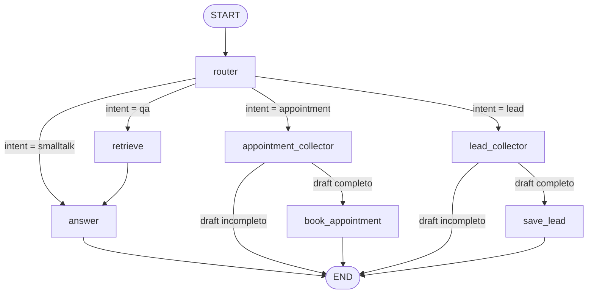
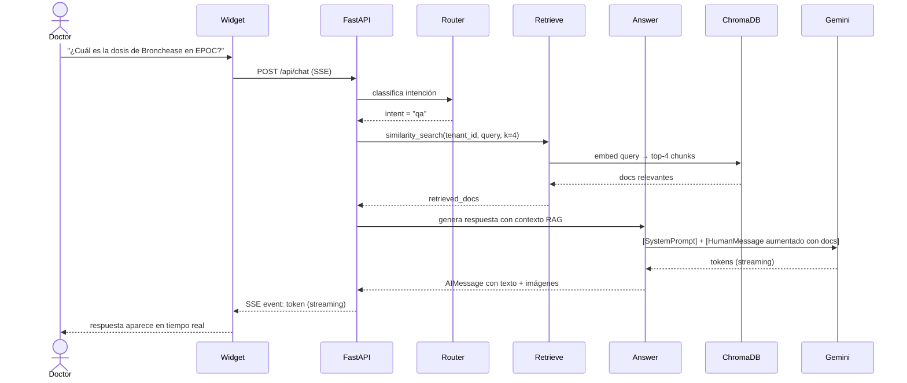
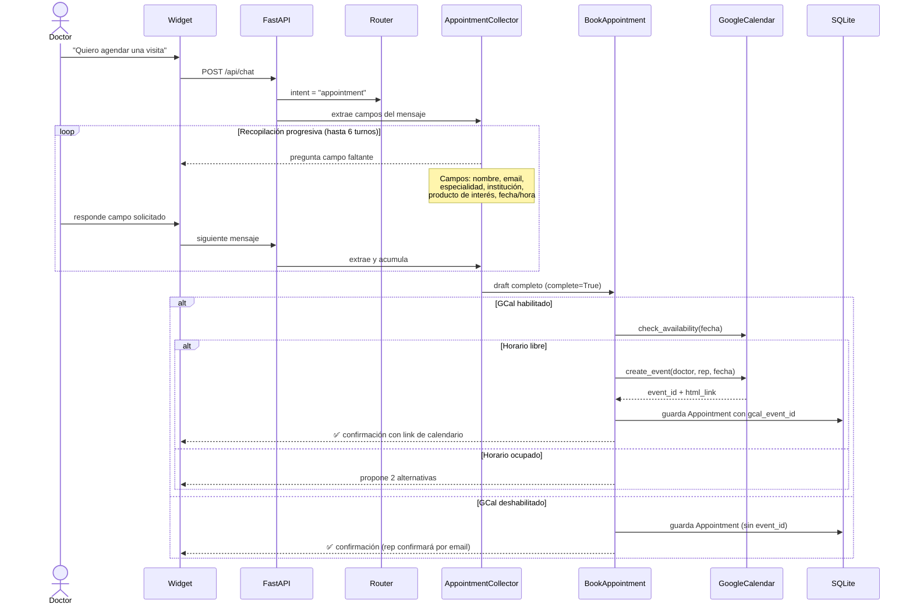
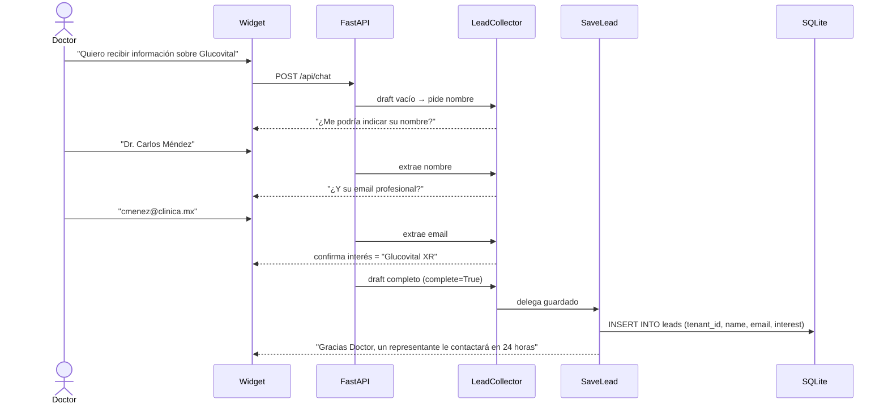

# Chaty — Documentación de Flujos

Stack: **LangGraph + FastAPI + Gemini + ChromaDB + SQLite**

---

## Arquitectura general

Cada mensaje del usuario pasa por el mismo pipeline:

```
Widget (JS) ──POST /api/chat──► FastAPI ──► LangGraph Graph ──► Gemini LLM
                                                │
                                         SQLite checkpoint
                                         (memoria por sesión)
```

El grafo mantiene estado persistente por `thread_id = "{tenant_id}:{session_id}"`. Cada sesión de navegador tiene su propio `session_id` (UUID guardado en `localStorage`), así el historial de conversación sobrevive recargas de página.

---

## Grafo LangGraph



---

## Flujo 1 — Q&A con RAG

**Trigger:** el médico hace una pregunta clínica sobre productos, indicaciones, dosis, estudios o interacciones.



**Detalle técnico:**
- El contexto RAG se inyecta **dentro del HumanMessage** (no en el system prompt) para mayor confiabilidad con Gemini.
- Si el contexto contiene imágenes ``, se incluyen en la respuesta.
- La recuperación está scoped por `tenant_id` en ChromaDB, así distintos clientes tienen bases de conocimiento separadas.

---

## Flujo 2 — Agendamiento de cita

**Trigger:** el médico quiere agendar una visita presencial o virtual con el representante.



**Estado del draft (AppointmentDraft):**

| Campo | Tipo | Descripción |
|-------|------|-------------|
| `doctor_name` | str | Nombre del médico |
| `doctor_email` | str | Email (validado con regex) |
| `specialty` | str | Especialidad médica |
| `institution` | str | Clínica u hospital |
| `product_interest` | str | Producto(s) de interés |
| `preferred_datetime_text` | str | Fecha/hora tal como la dijo el médico |
| `parsed_datetime` | str (ISO) | Fecha parseada con `dateparser` |
| `modality` | "presencial"\|"virtual" | Modalidad de la visita |
| `complete` | bool | `True` cuando todos los campos requeridos están |

**Persistencia:** el draft se guarda en el checkpoint de SQLite entre turnos. Si el médico interrumpe la conversación y regresa, retoma donde quedó.

---

## Flujo 3 — Captura de lead

**Trigger:** el médico quiere recibir información por email, solicitar muestras médicas, o dejar sus datos sin agendar una visita.



**Estado del draft (LeadDraft):**

| Campo | Tipo | Descripción |
|-------|------|-------------|
| `name` | str | Nombre del médico |
| `email` | str | Email profesional |
| `interest` | str | Producto o información solicitada |
| `complete` | bool | `True` cuando los 3 campos están completos |

**Ver leads capturados:**
```
GET http://localhost:8000/api/leads?tenant_id=pharmagen
```

---

## Flujo 4 — Smalltalk

**Trigger:** saludos, agradecimientos, despedidas, preguntas generales no clínicas.

El router detecta estos casos con expresiones regulares (sin llamada al LLM) y los dirige directo al nodo `answer` con el system prompt del tenant, sin RAG.

Ejemplos clasificados como smalltalk: `"hola"`, `"buenos días"`, `"gracias"`, `"hasta luego"`, `"ok"`, `"perfecto"`.

---

## Router — Lógica de clasificación

```
mensaje entrante
        │
        ▼
¿hay appointment_draft incompleto en checkpoint?
        │ sí → intent = "appointment"
        │
        ▼ no
¿hay lead_draft incompleto en checkpoint?
        │ sí → intent = "lead"
        │
        ▼ no
¿mensaje coincide con regex de smalltalk?
        │ sí → intent = "smalltalk" (sin LLM)
        │
        ▼ no
¿mensaje contiene keyword de cita?
        │ sí → intent = "appointment" (sin LLM)
        │
        ▼ no
        LLM clasifica: qa | appointment | lead | smalltalk
```

El fast-path (sin LLM) aplica para ~60% de los turnos en una conversación típica, reduciendo latencia.

---

## Multi-tenancy

Cada cliente tiene su propia carpeta en `backend/app/tenants/{tenant_id}/`:

```
tenants/
└── pharmagen/
    ├── config.yaml       # name, greeting, brand_color, system_prompt
    ├── knowledge/        # archivos .md que se indexan en ChromaDB
    │   ├── productos.md
    │   └── ...
    └── images/           # imágenes de productos servidas en /tenants/pharmagen/images/
```

La ingesta de ChromaDB está scoped por `tenant_id` en los metadatos de cada chunk. Un solo backend puede servir múltiples tenants simultáneamente.

---

## Streaming de tokens (SSE)

```
FastAPI (astream_events)
    │
    ├── on_chat_model_stream (nodo "answer")       → event: token
    ├── on_chat_model_stream (nodo "appointment_collector") → event: token
    ├── on_chat_model_stream (nodo "lead_collector")  → event: token
    │
    └── fin del grafo → event: done

Widget JS
    ├── event: token → botReply += data → actualiza burbuja
    └── event: done  → finaliza
```

El primer token aparece en el widget en < 1 segundo. Los nodos de respuesta son `async` y usan `await llm.ainvoke()` para que LangGraph intercepte correctamente los chunks de Gemini.
